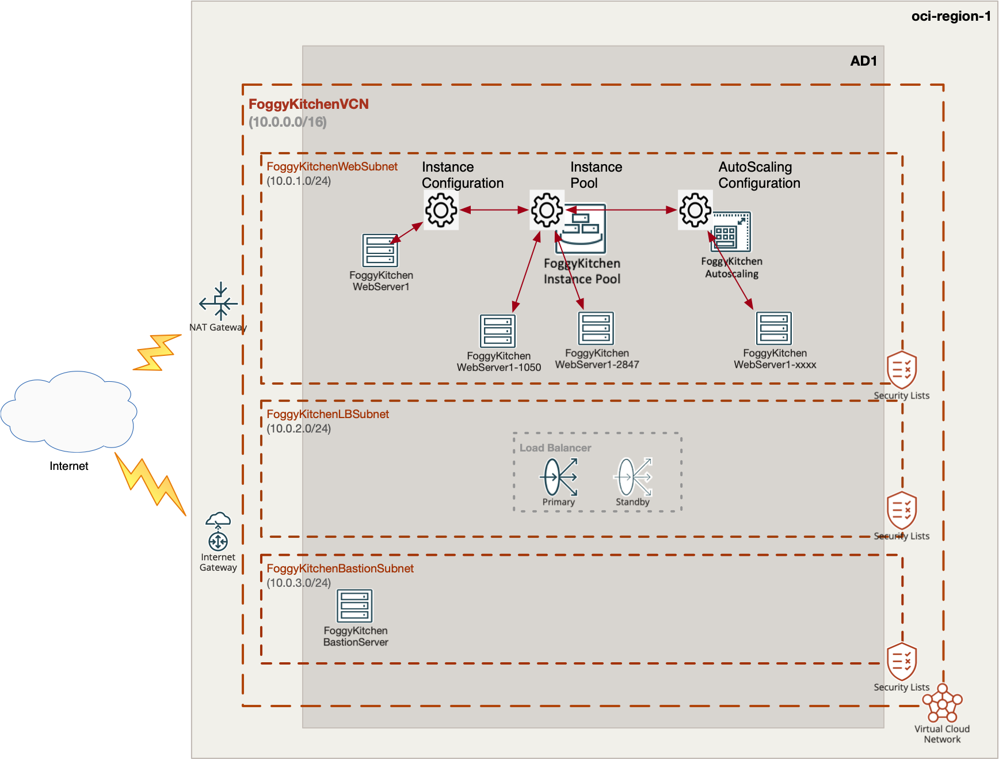

# 🚀 Terraform OCI Compute Autoscaling

This repository contains a complete example of **OCI Compute autoscaling** built with [Terraform](https://www.terraform.io) / [OpenTofu](https://opentofu.org).  
It provisions a private web tier on **Oracle Cloud Infrastructure (OCI)** and scales automatically using:

- 🧱 **Instance Configuration** – defines the golden template for compute instances  
- 🌀 **Instance Pool** – manages a fleet of identical backend servers  
- 📈 **Autoscaling Configuration** – threshold-based or scheduled scaling policies

The setup is intentionally minimal and modular — designed as a building block for larger environments.

---

  
*Figure 1 – OCI Compute Autoscaling architecture using Instance Configuration, Instance Pool and Autoscaling Configuration.*

---

## 🏗️ Architecture Overview

- **VCN** with a private backend subnet for autoscaled webservers  
- Optional Bastion and NAT Gateway for administrative and outbound traffic  
- Instance Configuration → Instance Pool → Autoscaling Configuration chain

> Autoscaling can be triggered either by **average CPU utilization** or by **scheduled cron expressions**.

---

## 📋 Prerequisites

- Terraform or OpenTofu ≥ 1.6  
- OCI account + API key (tenancy OCID, user OCID, fingerprint, private key)  
- A target compartment  
- An SSH public key if your bootstrap uses it (optional)

---

## ⚙️ Configuration

Use the provided [`terraform.tfvars.example`](./terraform.tfvars.example) file as the **single source of truth** for your environment.

```bash
cp terraform.tfvars.example terraform.tfvars
```

### terraform.tfvars.example

```hcl
# Authentication
tenancy_ocid      = "ocid1.tenancy.oc1..(...)"
user_ocid         = "ocid1.user.oc1..(...)"
fingerprint       = "a7:(...):40"
private_key_path  = "/Users/myuser/.oci/oci_api_key.pem"

# Region
region = "eu-frankfurt-1"

# Compartment
compartment_ocid = "ocid1.compartment.oc1..(...)"

# Feature toggles
enable_instance_configuration  = true
enable_instance_pool           = false
enable_threshold_autoscaling   = false
enable_scheduled_autoscaling   = false
```

---

## 🧭 Recommended Workflow

1️⃣ **Validate Instance Configuration**  
Enable only `enable_instance_configuration = true`, apply and verify the base VM settings.

2️⃣ **Enable Instance Pool**  
Set `enable_instance_pool = true` and re-apply. The pool will launch initial instances.

3️⃣ **Choose one autoscaling mode**

- **Threshold-based (CPU):**

```hcl
enable_threshold_autoscaling = true
pool_min      = 2
pool_initial  = 2
pool_max      = 6
scale_out_cpu = 70
scale_in_cpu  = 25
```

- **Scheduled (cron):**

```hcl
enable_scheduled_autoscaling = true
pool_min     = 2
pool_initial = 2
pool_max     = 6
# Example: Mon–Fri 08:00 scale out, 20:00 scale in (UTC)
schedule_scale_out_cron = "0 8 * * 1-5"
schedule_scale_in_cron  = "0 20 * * 1-5"
```

> ⚠️ Autoscaling modes are **mutually exclusive** — enabling both will produce a plan error.

---

## 🚀 Usage

Initialize providers and modules:

```bash
tofu init
```

Show planned changes:

```bash
tofu plan
```

Apply the configuration:

```bash
tofu apply
```

Destroy resources:

```bash
tofu destroy -auto-approve
```

---

## 🧪 Testing Autoscaling

For **threshold-based autoscaling**, generate load against your backend (e.g., `ab`, `wrk`) and monitor:

- **OCI Console → Compute → Instance Pools → Scaling Activity**  
- Instance CPU metrics in **OCI Monitoring**

For **scheduled autoscaling**, adjust cron expressions and observe pool resizing at expected times.

---

## 📂 Repository Structure

```
.
├── bastion_instance.tf                  # (optional) Bastion host
├── compartment.tf                       # Dedicated compartment
├── datasources.tf                       # Image and AD lookups
├── instance_autoscaling_scheduled.tf    # Scheduled autoscaling policy
├── instance_autoscaling_threshold.tf    # CPU threshold autoscaling policy
├── instance_configuration.tf           # Instance Configuration (golden template)
├── instance_pool.tf                    # Instance Pool definition
├── loadbalancer.tf                     # Public LB (optional)
├── locals.tf                           # Derived variables (tags, naming)
├── network.tf                          # VCN, subnets, routes, gateways
├── output.tf                           # Outputs (IPs, pool IDs)
├── provider.tf                         # OCI provider setup
├── tls.tf                              # Key generation (optional)
├── variables.tf                        # Variable definitions
├── webserver_instance.tf               # Single reference instance
├── userdata/                           # Bootstrap scripts (cloud-init)
│   └── bootstrap.sh
├── terraform.tfvars.example            # Example variable file
└── README.md
```

---

## 📝 Notes

- Authentication uses **user API keys** for simplicity. For production, consider **Instance Principals** or Dynamic Groups with IAM policies.  
- All resources are created in a **dedicated compartment**.  
- Backend subnet is **private by default**; only the Load Balancer is public.  
- You can treat this repo as a **Terraform module** in larger deployments.

---

## 🧹 Clean Up

```bash
tofu destroy -auto-approve
```

---

## 🪪 License

Licensed under the Universal Permissive License (UPL), Version 1.0.  
See [LICENSE](./LICENSE) for details.
